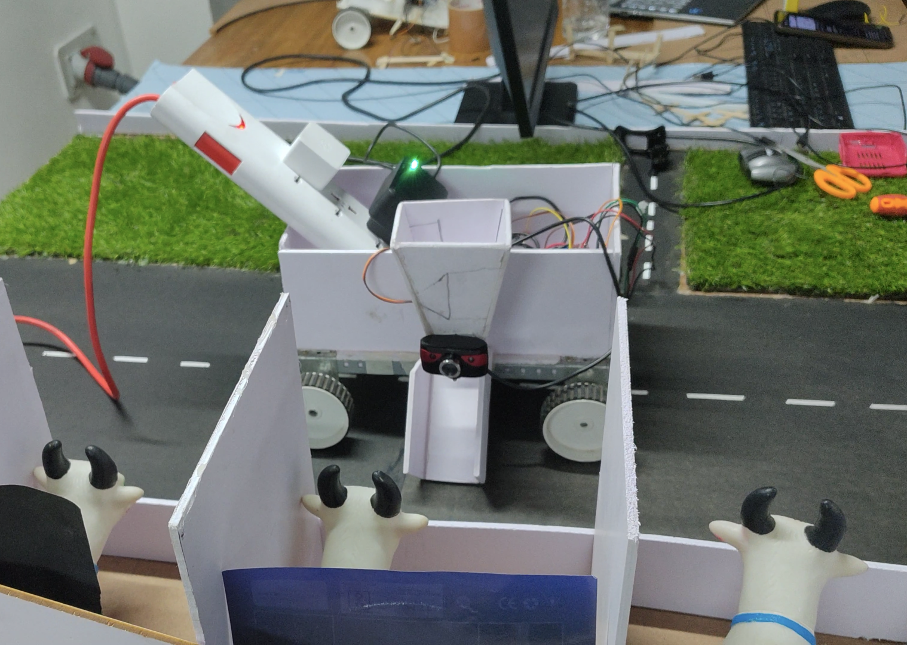
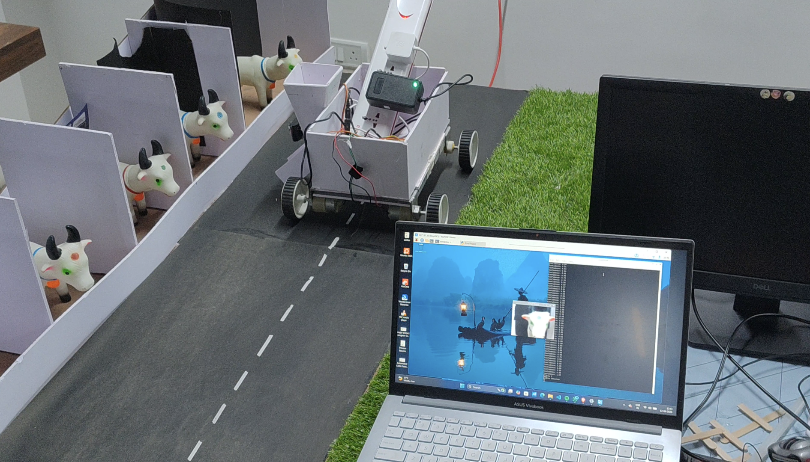

# 🚀 Offline Robo Attendance System

## 📌 Overview
This project is an automated attendance system using a robotic vehicle.  
It detects cows using sensors/camera and records attendance without internet (offline mode).

## ⚙️ Features
- 🤖 Automated movement using robot vehicle
- 📷 Object detection (cow detection)
- 🔌 Works in offline mode
- 🧠 Embedded system using Arduino / Raspberry Pi
- ⚡ Real-time monitoring

## 🛠️ Technologies Used
- Arduino
- Raspberry Pi
- Python
- Embedded C
- Sensors (PIR / Camera)
- Motor Driver

## 📷 Project Images

## 📂 How it Works
1. Robot moves along the path
2. Sensors/camera detect cows
3. Data is processed using controller
4. Attendance is recorded automatically

## 🔮 Future Improvements
- AI-based detection (better accuracy)
- Mobile app integration
- Cloud storage support

## 👨‍💻 Author
**Darshan HR**  
EEE Student | Embedded Systems & IoT Enthusiast
